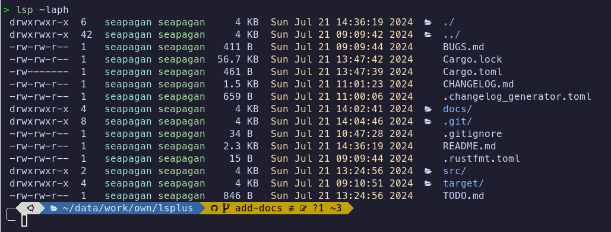

# LSPlus - an 'ls' clone written in Rust.

[](https://github.com/seapagan/lsplus/actions/workflows/rust.yml)
[](https://github.com/seapagan/lsplus/actions/workflows/pages/pages-build-deployment)

This is currently a very simple (though functional) clone of the Unix 'ls' 
command written in Rust. It is a learning project for me to learn Rust so 
probably contains many inefficiencies and bad practices. I'll get better :grin:



## Installation

To install the latest release of this package, you can use the following command:

### Latest Release

```bash
cargo install lsplus
``` 

This will install the `lsp` binary into your `~/.cargo/bin` directory. Make 
sure that this directory is in your `PATH` environment variable so that you 
can run the `lsp` command from anywhere.

## From Source

You can also install the package from source by cloning the repository and 
running the following command:

```bash
git clone https://github.com/seapagan/lsplus.git
cd lsplus
cargo install --path .
```


## Usage

Run this command in your terminal to list files in the current directory:

```sh
lsp <options> <path | file>
```

Both the options and the path are optional. If no path is provided, the current
directory will be listed. If no options are provided, the default options will
be used which are similar to the `ls` command.

Curently, only a sub-set of the standard `ls` options are supported. These are:

- `-a` / `--all` - Show hidden files
- `-A` / `--almost-all` - Show hidden files, but don't show `.` and `..
- `-p` / `--slash-dirs` - Append a '/' to directories
- `-l` / `--long` - Show long format listing
- `-h` / `--human-readable` - Human readable file sizes
- `-D` / `--sort-dirs` - Sort directories first

Many of the remaining options are planned to be implemented in the future. 

The long-format listing is colorized by default and cannot be disabled, but 
there will be an option to disable colors in the future.

Icons are added to folders and links, this will be improved to show relevant
icons for other file types in the future.

### Aliases

The `lsp` command can be aliased to `ls` by adding the following line to your
`.bashrc`, `.zshrc` or similar file:

```sh
alias ls='lsp'
```

You will need to restart your shell or source your configuration file for the
alias to take effect.

The example below shows an alias for ls that uses many of the current options:

```sh
alias ls='lsp -laph'
```

This will show a long format listing with hidden files, append a '/' to
directories, and show human readable file sizes, as in the image above.

