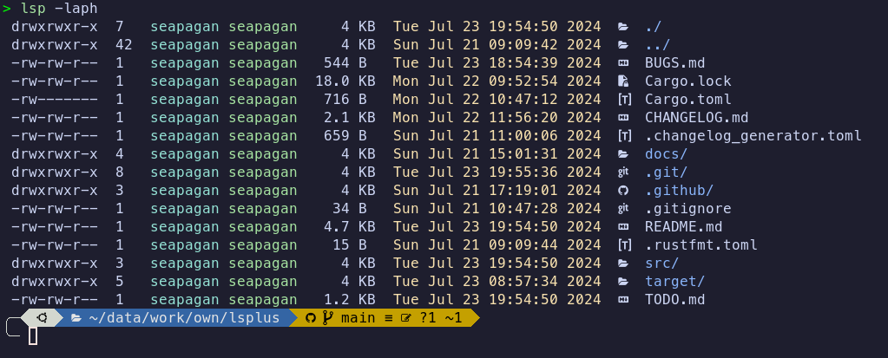

# LSPlus - an 'ls' clone written in Rust

[](https://github.com/seapagan/lsplus/actions/workflows/rust.yml)
[](https://github.com/seapagan/lsplus/issues)

[](https://crates.io/crates/lsplus)
[](https://app.codacy.com/gh/seapagan/lsplus/dashboard?utm_source=gh&utm_medium=referral&utm_content=&utm_campaign=Badge_grade)
[](https://github.com/seapagan/lsplus/actions/workflows/gh-pages.yml)

This is currently a very simple (though functional) clone of the Unix 'ls' 
command written in Rust. It is a learning project for me to learn Rust so 
probably contains many inefficiencies and bad practices. I'll get better
with time! 😁



<!-- vim-markdown-toc GFM -->

- [Compatibility](#compatibility)
- [Nerd Fonts](#nerd-fonts)
- [Installation](#installation)
  - [Latest Release](#latest-release)
  - [From Source](#from-source)
- [Usage](#usage)
  - [Fuzzy Time](#fuzzy-time)
  - [Icons](#icons)
  - [Aliases](#aliases)
- [Future Plans](#future-plans)

<!-- vim-markdown-toc -->

## Compatibility

This project is currently only compatible with Unix-like systems (Linux,
MacOs, etc.). Windows support is planned to be added very soon.

## Nerd Fonts

To display the folder and file icons, you need to first install a 'Nerd Font' 
for your terminal. You can find a great selection of Nerd Fonts
[here](https://www.nerdfonts.com/)

My personal favourite is `MesoLG Nerd Font`, but there are many others to choose
from. You will also need to set up your terminal to use that font.

If you **DO NOT** want to install a Nerd Font, pass the `--no-icons` switch to 
the program.

## Installation

### Latest Release

To install the latest release of this package, you can use the following command:

```bash
cargo install lsplus
```

This will install the `lsp` binary into your `~/.cargo/bin` directory. Make 
sure that this directory is in your `PATH` environment variable so that you 
can run the `lsp` command from anywhere.

### From Source

You can also install the package from the GitHub repository by running the 
following command:

```bash
cargo install --git https://github.com/seapagan/lsplus.git
```

## Usage

Run this command in your terminal to list files in the current directory:

```sh
lsp <options> <path | file>
```

Both the options and the path are optional. If no path is provided, the current
directory will be listed. If no options are provided, the default options will
be used which are similar to the `ls` command.

Curently, only a sub-set of the standard `ls` options are supported. These are:

- `-a` / `--all` - Show hidden files
- `-A` / `--almost-all` - Show hidden files, but don't show `.` and `..
- `-p` / `--slash-dirs` - Append a '/' to directories
- `-l` / `--long` - Show long format listing
- `-h` / `--human-readable` - Human readable file sizes
- `-D` / `--sort-dirs` - Sort directories first
- `--no-icons` - don't show file or folder icons
- `-Z` / `--fuzzy-time` - Show fuzzy time for file modification times

You can combine the short options together, e.g. `-laph` will show a long format
listing with hidden files, append a '/' to directories, and show human-readable
file sizes.

Use the `--help` option to see the full list of options.

The long-format listing is currently colorized by default and cannot be
disabled. This will be made configurable in the future along with adding more
of the original `ls` options.

### Fuzzy Time

The `-Z` option will show a fuzzy time for file modification times. This will
show the time in a human-readable format, e.g. '2 hours ago', 'yesterday', etc.


### Icons

Icons are added to folders, files, and links. There is only a limited set of
mappings implemented at the moment, but more will be added in the future. Add
an issue if you have a specific icon you would like to see - even better, add
a Pull Request implementing it! 😁

You can disable the icons by using the `-no-icons` option.

### Aliases

The `lsp` command can be aliased to `ls` by adding the following line to your
`.bashrc`, `.zshrc` or similar file:

```sh
alias ls='lsp'
```

You will need to restart your shell or source your configuration file for the
alias to take effect.

The example below shows an alias for ls that uses many of the current options:

```sh
alias ls='lsp -laph'
```

This will show a long format listing with hidden files, append a '/' to
directories, and show human readable file sizes, as in the image above.

## Future Plans

I am planning to add many more features to this project in the future. Check out
the [TODO](./TODO.md) file for a list of planned features and improvements.
