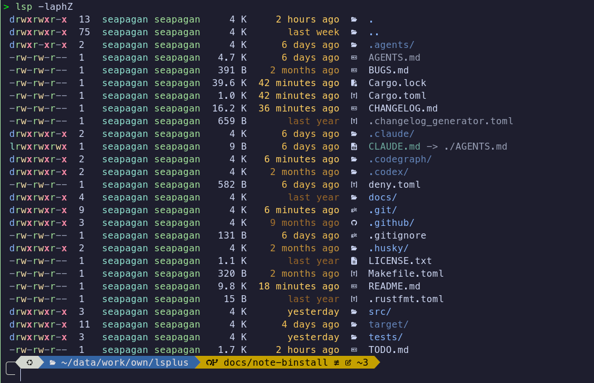
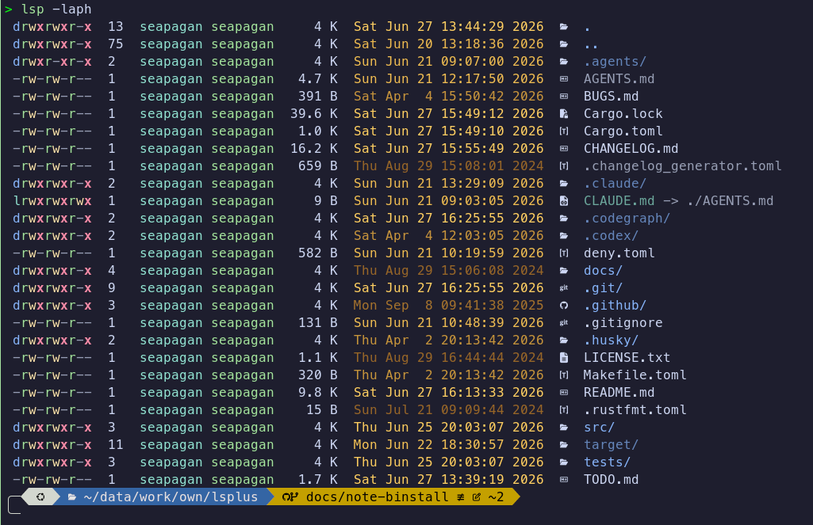
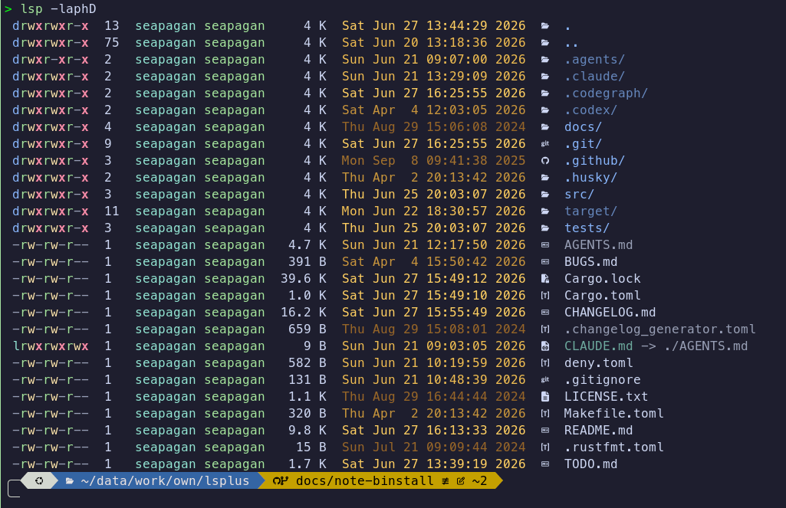

# Usage

Run this command in your terminal to list files in the current directory:

```sh
lsp <options> <path | file>
```

Both the options and the path are optional. If no path is provided, the current
directory will be listed. If no options are provided, the default options will
be used which are similar to the `ls` command.

Curently, only a sub-set of the standard `ls` options are supported. These are:

- `-a` / `--all` - Show hidden files
- `-A` / `--almost-all` - Show hidden files, but don't show `.` and `..
- `-p` / `--slash-dirs` - Append a '/' to directories
- `-l` / `--long` - Show long format listing
- `-h` / `--human-readable` - Human readable file sizes
- `-D` / `--sort-dirs` - Sort directories first
- `-I` / `--gitignore` - Dim entries matched by Git ignore rules
- `-N` / `--no-color` - Disable colored and styled output
- `--no-icons` - don't show file or folder icons
- `-V` / `--version` - Print version information and exit
- `-Z` / `--fuzzy-time` - Show fuzzy time for file modification times

You can combine the short options together, e.g. `-laph` will show a long format
listing with hidden files, append a '/' to directories, and show human-readable
file sizes.

Use the `--help` option to see the full list of options.

Styled output is enabled automatically when writing to a terminal. Captured,
piped, and redirected output is plain by default. You can also disable styled
output explicitly with `--no-color`, `no_color = true` in the config file, or
the `NO_COLOR` environment variable.

When `-I` is enabled, `lsp` checks the same ignore sources Git normally uses:
merged `.gitignore` files in the worktree, `.git/info/exclude`, and the
configured global Git excludes file.

## Compatibility Mode

`lsp` has two CLI modes:

- `native` - the default `lsplus` command-line interface
- `gnu` - a GNU `ls` compatibility mode intended for aliases and scripts

You can enable GNU compatibility mode by setting `compat_mode = "gnu"` in the
config file or by setting `LSP_COMPAT_MODE=gnu` in the environment. The
environment variable takes precedence over the config file.

At the moment, `gnu` mode changes the CLI surface and help output only. It does
not yet implement the missing GNU meanings for the conflicting short flags
`-D`, `-I`, `-N`, and `-Z`; those flags are reserved in `gnu` mode and will
error until their GNU behavior is implemented.

The current `lsplus` features behind those four native short flags are still
available in `gnu` mode through their long forms only:

- `--group-directories-first` (replaces the original `--sort-dirs`)
- `--gitignore`
- `--no-color`
- `--fuzzy-time`

In `gnu` mode, `-p` uses the GNU-style long form `--indicator-style=slash`
instead of the native `--slash-dirs`.

## Fuzzy Time

The `-Z` option will show a fuzzy time for file modification times. This will
show the time in a human-readable format, e.g. '2 hours ago', 'yesterday', etc.



## Icons

Icons are added to folders, files, and links. There is only a limited set of
mappings implemented at the moment, but more will be added in the future. Add
an issue if you have a specific icon you would like to see - even better, add
a Pull Request implementing it! :grin:

You can disable the icons by using the `--no-icons` option.

## Aliases

The `lsp` command can be aliased to `ls` by adding the following line to your
`.bashrc`, `.zshrc` or similar file:

```sh
alias ls='lsp'
```

If you want that alias to behave more like GNU `ls`, enable `gnu`
compatibility mode in your config file or set `LSP_COMPAT_MODE=gnu` in your
shell environment.

You will need to restart your shell or source your configuration file for the
alias to take effect.

The example below shows an alias for ls that uses many of the current options:

```sh
alias ll='lsp -laph'
```

This will show a long format listing with hidden files, append a '/' to
directories, and show human readable file sizes.

You can also use the configuration file to set the default options you want.



If you add the '-D' option to the command, directories will be sorted first:


