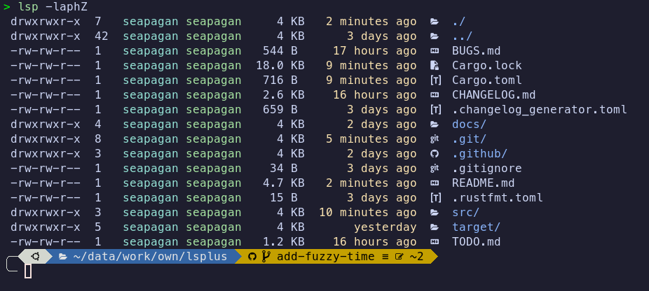
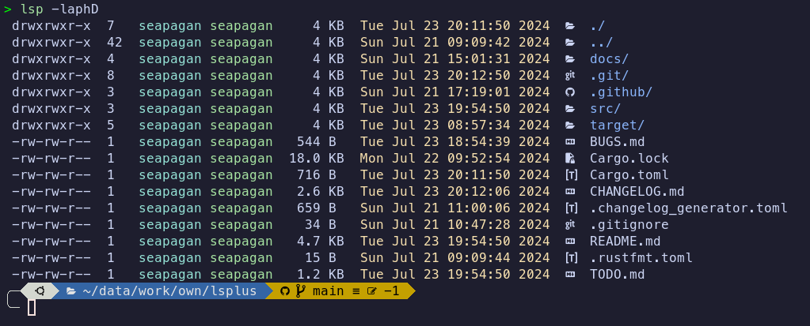

# Usage

Run this command in your terminal to list files in the current directory:

```sh
lsp <options> <path | file>
```

Both the options and the path are optional. If no path is provided, the current
directory will be listed. If no options are provided, the default options will
be used which are similar to the `ls` command.

Curently, only a sub-set of the standard `ls` options are supported. These are:

- `-a` / `--all` - Show hidden files
- `-A` / `--almost-all` - Show hidden files, but don't show `.` and `..
- `-p` / `--slash-dirs` - Append a '/' to directories
- `-l` / `--long` - Show long format listing
- `-h` / `--human-readable` - Human readable file sizes
- `-D` / `--sort-dirs` - Sort directories first
- `--no-icons` - don't show file or folder icons
- `-Z` / `--fuzzy-time` - Show fuzzy time for file modification times

You can combine the short options together, e.g. `-laph` will show a long format
listing with hidden files, append a '/' to directories, and show human-readable
file sizes.

Use the `--help` option to see the full list of options.

The long-format listing is currently colorized by default and cannot be
disabled. This will be made configurable in the future along with adding more
of the original `ls` options.

## Fuzzy Time

The `-Z` option will show a fuzzy time for file modification times. This will
show the time in a human-readable format, e.g. '2 hours ago', 'yesterday', etc.



## Icons

Icons are added to folders, files, and links. There is only a limited set of
mappings implemented at the moment, but more will be added in the future. Add
an issue if you have a specific icon you would like to see - even better, add
a Pull Request implementing it! :grin: 

You can disable the icons by using the `-no-icons` option.

## Aliases

The `lsp` command can be aliased to `ls` by adding the following line to your
`.bashrc`, `.zshrc` or similar file:

```sh
alias ls='lsp'
```

You will need to restart your shell or source your configuration file for the
alias to take effect.

The example below shows an alias for ls that uses many of the current options:

```sh
alias ll='lsp -laph'
```

This will show a long format listing with hidden files, append a '/' to
directories, and show human readable file sizes.


If you add the '-D' option to the command, directories will be sorted first:


